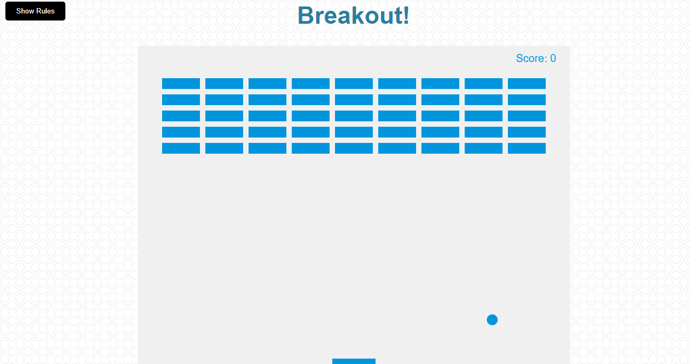

# Breakout

---

Simple game built with vanilla JS.

---

## Table of Contents

---

- [Breakout](#breakout)
- [Rules](#rules)
- [Technologies](#technologies)
- [Screenshot](#screenshot)
- [Deployed Application](#deployed-application)

---

## Rules

---

Use your right and left keys to move the paddle to bounce the ball up
and break the blocks. If you miss the ball, your score and the blocks will be reset.

---

## Technologies

---

<b>Built with</b>

- [HTML5](https://developer.mozilla.org/en-US/docs/Web/Guide/HTML/HTML5)
- [CSS3](https://developer.mozilla.org/en-US/docs/Web/CSS)
- [Javascript](https://developer.mozilla.org/en-US/docs/Web/JavaScript)

---

## Screenshot

---

---

## Deployed Application

---

<a href="https://graysondeese.github.io/Breakout/">Breakout</a>
